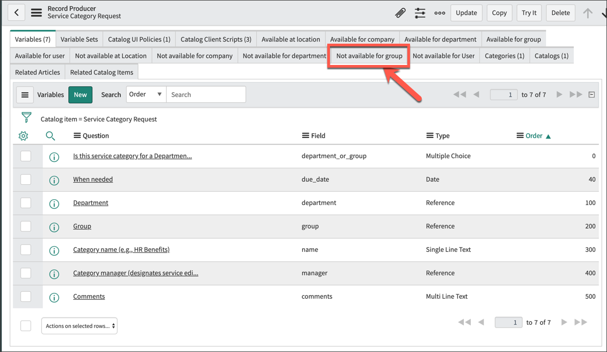
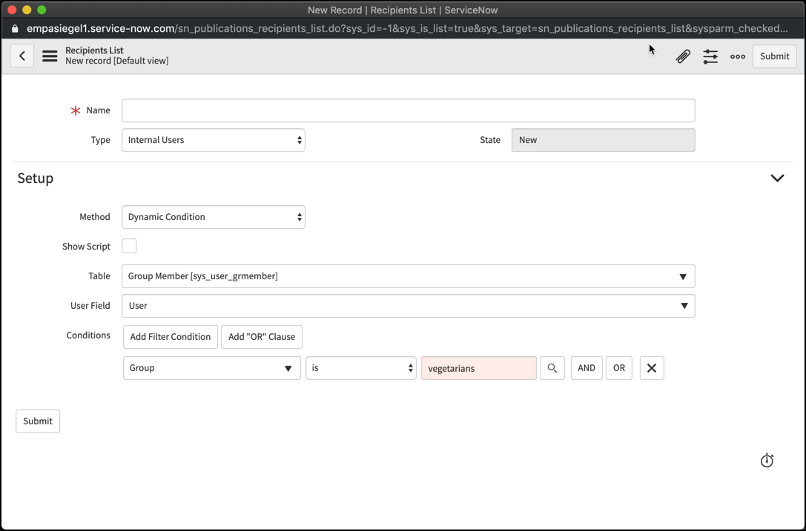
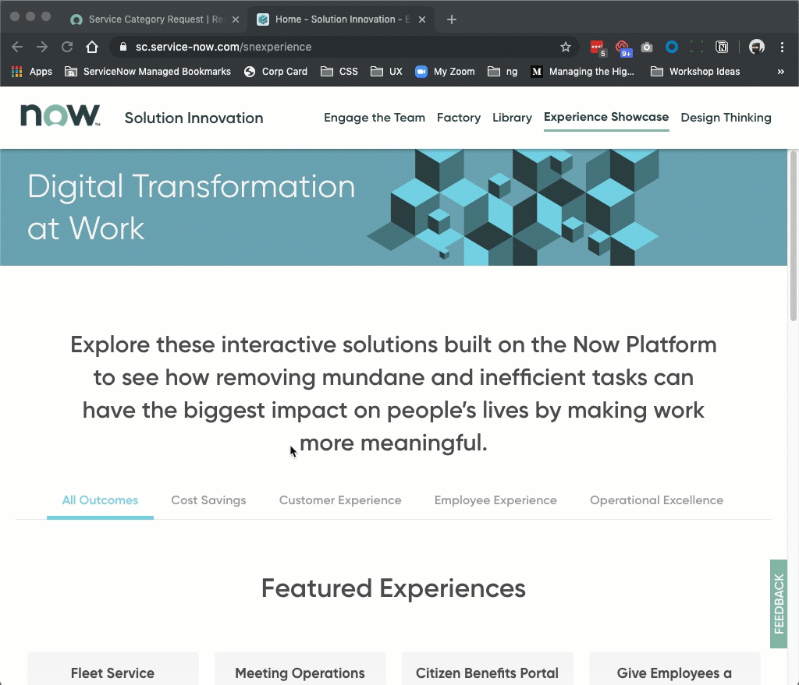
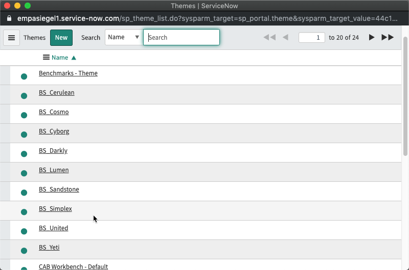

# Introduction

## Scenario

Our customer "ServiceNow Suites" currently has a self-service portal on ServiceNow for ordering Room Service. It has been deployed for the last 1 year to mixed customer feedback about the experience of ordering room service. Some common complaints include customer confusion around dietary restrictions, difficulty finding and submitting the desired meal choices, and a lack of brand cohesion between the portal and the customer's public facing site.

## Goal

The goal of this lab is the reinforce the Best Practices and Key Capabilities from the presentation today. In it you will leverage key ServiceNow capabilities to design a portal that is contextual to the user; with relevant content and catalog items, visually different; with the application of a simple or complex theme change, and representative of a portal that helps a customer's journey to self-service

### Getting Started - Log on to Your Training Instance

1. Navigate to the unique instance URL provided to you.
1. Log on with the provided credentials
1. Change your password to something memorable just in case you get logged out of your instance.

# Lab 1 - Understanding the Current State

## Goal

In this lab we are going to get a better understanding of the current state of the portal. To do this we want to look at capabilities the platform provides but also get feedback from users

## 1.1 - Usage Overview

First we'll look at **Usage Overview** to gather quantitative data about user's behaviors on the portal. Here you can see the most popular *search terms*, *pages*, *knowledge article*, and more...

1. Log in to your instance
1. In the App Navigator locate **Service Portal \> Usage Overview**
1. Review the Service Portal Search Terms

### Think About

> What are the most popular search terms?
>
> Are people typing in terms that do not correlate to data in your catalog?
>
> Are there popular search terms to just do not make sense?

## 1.2 - Survey Results

To learn more about the current state of your company's portal, we ran a survey last month with a sample of *50* users. Let's review what those users had to say

1. Navigate to **Surveys \> View Surveys**
1. Open the record *Room Service Portal Survey*
1. Click **View Scorecard**

### Think About

> What are the weakest attributes of the portal based on the survey data?
>
> Are there any interesting comments that can inform your path forward?

**Note:** We recommend this survey as a way for customers to assess the current state of their portal. You can download the [update set](files/survey.xml) with the survey.

## 1.3 - Usability Study

Now we want to collect qualitative feedback by observing how someone interacts with the current portal. For this lab, you'll be pairing off with a partner and each assuming a different role.

1. Pair off with another lab participant
1. Introduce yourselves - Name, Role, Location
1. Whoever traveled the **FURTHEST** to get here will be the *Participant*. The other will play the role of *Facilitator*
1. The facilitator's job is to observe how the participant completes the task(s) assigned.
1. The presenters will share the task with you.
1. The participant's job is to try and complete the assigned task(s).
1. The facilitator should take notes as they observe how the tasks are completed.

### Think About

Was the participant able to easily complete the tasks presented to them?
If not, where did they encounter issues?
How might we leverage the platform to reduce the friction the participant encountered?

# Lab 2 - Information Finds the User

## Goal

In this lab, we'll be leveraging a set of capabilities to effectively bring information to the user. By leveraging what the platform knows about the user, the Portal can present information that is uniquely relevant to them. These are just a few ways this information can be used; when working with your customers, think about how they might leverage these capabilities to create a tailored experience.

## 2.1 - Vegetarians Don't Eat Meat - Use User Criteria to filter their Menu

One of the things we noticed in our usability study was that guests with certain food allergies, had a hard time finding menu items that met their dietary needs. Let’s use User Criteria to filter what these guests see.

1. Open the User Profile for *FIRST LAST* and review the Groups they belong to. One of their groups should be **Vegetarians**
1. Now, navigate to **Maintain Items** and identify all the meat-based "menu" items
1. Select an item and scroll down the the *Related Lists* and select **Not Available For Group**

1. Click **Edit** and add the group *Vegetarians* from the slush bucket.
1. Save your changes
1. Repeat for the remaining meat items.

### Let's test this

1. Impersonate Jane Doe
1. Go to the portal and make sure you don't see the meat-based catalog items.

### **CHALLENGE**

For KB articles, you can only user Criteria at the Category level. How might you hide all meat recipes from a vegetarian user?

## 2.2 Vegetarians also like to hear news about new menu offerings

The market of plant-based alternatives to beef and chicken continues to expand, and with that our restaurant's menu is constantly evolving. How might we target vegetarians with announcements about menu updates?

1. Navigate to **Targeted Communications \> Create New Publication**
1. Configure the publication

    Field | Value
    ------|-------
    **Short Description** | Introducing new Impossible Burgers&trade; to the menu!
    **Content** | This month, we are excited to introduce a new addition to our Vegetarian Menu, the Impossible Burger&trade;. All of our mouth-watering burger specials can now be had with the delicious plant-based patty. In addition, we are introducing 2 new burgers that feature the Impossible Burger; the Predictably Impossible and the Impossibly Sweet Burgers. Enjoy the savory juiciness in our new offerings.
    **Content Type** | HTML
    **Category** | Information
    **Publish Date** | Jan 23, 2020
    **Expiry Date** | Jan 30, 2020
    **Email Template** | ImpossibleEmails

1. Open up the *Recipient List* and create a new list.
1. Modify the setup to the following

    Field | Value
    ------|-------
    **Method** | Dynamic Condition
    **Table** | sys_user_grmember
    **User Field** | user
    **Condition** | group IS vegetarians

    

1. Submit the Publication
1. **TODO* Any more steps? TKTKTKTK

## Lab 2.3 When they read about the Room Service policies, they want information relevant to them - Knowledge Blocks

To wrap up this lab, we are going to configure some articles to show content based on User Criteria. This will use *Knowledge Blocks* to provide dynamic information, based on the user's profile.

1. Go to Knowledge\>All in the Application Navigator
1. Open the article: Impossible Meat Ingredient Information
   >You’ll notice there is content for EVERY allergy issue possible in their recipe. Instead, we only want to show guests information related to their allergies
1. Remove the content between the Allergy Info heading and the Nutrition Facts heading and save your article
1. Navigate to Create new Block in the Application Navigator
1. Fill out the the form per the table below

    Field | Value
    ------|-------
    **Knowledge Base** | Knowledge
    **Can Read** | Guests with Soy Allergies
    **Short Description** | Soy Allergen Info
    **Article Body** | The Impossible Burger contains Soy.

1. Submit and Publish the block
1. Repeat steps 6-8, changing the Can Read, Short Description, and Article Body fields per the table below

    Can Read | Short Description | Article Body
    ------- | ------------- | --------
    Guest with Coconut Oil Allergy | Coconut Oil Allergen Info | The Impossible Burger contains Coconut Oil (the FDA classifies coconuts as tree nuts for food labelling purposes, but refined coconut oil is not considered an allergen).
    Guest with Potato Allergy | Potato Allergen Info | The Impossible Burger also contains potato protein. If you have an allergy to either raw or cooked potatoes, you should not consume the Impossible Burger.

1. Return to the Knowledge Article we edited earlier “Impossible Meat Ingredient Information”
1. Click the Add Blocks UI Action
1. In the Add Blocks panel search for “soy”
1. Put your cursor on a newline after the “Allergy Info” heading
1. Click Insert on the Soy block you created
1. Repeated steps 12-13 for “coconut oil” and “potato”
1. After the last Knowledge Block, add the following content
    >Impossible Burgers do not contain dairy, eggs, fish, peanuts, shellfish, or wheat, and it’s safe for those with alpha-gal syndrome.
1. Click Publish
1. Underneath “Related Links” click Preview Article with Blocks
1. Change the View As to Dosie Do (vegetarian with no allergies) and Susie Su (vegetarian with potato allergy) to how the article changes.

# Lab 3 - Consumers != Providers

## Goal

Often times, when creating content for a portal, customers create it from the perspective of the fulfiller and don't recognize that the user that will consume the content has a different level of knowledge, set of expectations and experiences as it relates to the issue. This often means that catalog items are confusing and users opt to call for help instead of self serving. In this lab, we'll take what we learned from the usability study and try and improve site content.

## Lab 3.1 - This form has so many options, I'd rather go hungry. - Form Design

In the usability studies we ran, participants struggled to complete their orders. They specifically pointed out that the forms felt really long and confusing for each menu item they wanted to add. How might we improve the form inputs to make it more approachable for guests?

1. Open the Hamburger catalog item from the Maintain Items Application Module
1. Delete all the Toppings checkbox variables from the item.
1. Create a new variable and set it up as follows

    Field | Value
    ------|-------
    **Type** | List Collector
    **Question** | What toppings would you like?
    **Name** | toppings
    **Order** | 100

1. Switch to the *Type Specifications* tab
1. Set the *List Table* field to **x_snc_ts20_portal_toppings**
1. Set the *Reference Qualifier* to `type=other`
1. Click Submit

Guests also have very specific preferences for the their cheese, so let's separate that from the rest of the toppings

1. Create a new variable and set it up as follows

    Field | Value
    ------|-------
    **Type** | List Collector
    **Question** | What toppings would you like?
    **Name** | toppings
    **Order** | 100

1. Switch to the *Type Specifications* tab
1. Set the *List Table* field to **x_snc_ts20_portal_toppings**
1. Set the *Reference Qualifier* to `type=cheese`
1. Click Submit

### Let's fix the Temperature as well

1. Open the **Internal Temperature** variable
1. Update the form according to the table

    Field | Value
    ------|-------
    **Type** | Select Box
    **Question** | How would you like your meat cooked?
    **Name** | doneness

1. Save the Record
1. Scroll down to the *Question Choices*
1. Create the following choices
  
   Text | Value | Order
   ----- | ----- | ----
   Rare | 120 | 100
   Medium Rare | 135 | 200
   Medium | 140 | 300
   Medium Well | 155 | 400
   Well Done | 160 | 500

1. Click Update

## Lab 3.2 - All I want is a sandwich, but now you are asking me to be a cook? - Variable Sets

<!-- TO DO -->
During the usability studying we ran, participants complained that the same questions were asked in many different ways and the order of options was never consistent. This caused them to make mistakes in filling out the forms. Lets use Variable Sets to ensure consistency across similar catalog items.

1. Reopen the Hamburger catalog item.
1. Switch to the *Variable Sets* related list.
1. Click **New**.
1. Click **Single-Row Variable Set**.
1. Set the **Title** to *Common Beef Items*.
1. Click Submit.
1. Switch to the *Variables* related list.
1. Select the *How would you like your meat cooked?* variable.
1. Clear out the *Catalog Item* field.
1. Hit tab to leave the field.
1. A new field will show up, titled *Variable Set*.
1. Select **Common Beef Items** reference.
1. Click **Update**.
1. Repeat Steps 8-13 for the *What toppings would you like?* variable.
1. Add the *Common Beef Items* variable set to the Cheese Steak catalog item.
1. Go to the `/sp` on your instance and open one of the catalog items you just edited. Does it have the new variables?

>**Take Away** How did the changes we make, make the experience easier for our guests to put in their order?

# Lab 4 - Don't Follow the Org Chart

## Goal

Similar to the previous lab, customers don't always know how to communicate to their end users. They use internal naming conventions, acronyms, and organize content based on their org chat. That does not always map to how users talk about the services and articles a portal provides. In this lab we'll explore how to learn about how users organize information and then use that insight to improve the catalog.

## Lab  4.1 - Card Sort

The first activity is to participate in a card sort. This is a *learning* activity to better understand the users before creating a solution. This is something a customer's User Experience Team might run, or you might help them setup this exercise. There are great third party tools out there to run these studies such as [Optimal Sort](https://www.optimalworkshop.com/optimalsort). For today, we'll just use a Visual Task Board (VTB) to simulate the exercise.

1. On your instance, use the Application Navigator to open *My Task Boards*
1. Make sure *Boards you Belong To* is the selected tab.
1. Open *Room Service Card Sort*
1. Take the next **5 Minutes** to organize all the cards (menu items) in the *Unsorted* lane into the appropriate lane (menu section) that you would expect to find that item.
1. If there is not a lane that your item fits into, feel free to use the **Add Lane** button to add a new menu section.

## Lab 4.2 - Update Catalog

We aggregated data from a similar exercise.

## Lab 4.3 - Improve the Meta Data

In our usability studies, we learned that participants struggled to find cheeseburgers in the catalog because there is no specific catalog item called **Cheeseburger**. It is just a hamburger with cheese as a variable. Now we could add a separate catalog item, or improve the search results through meta data.

1. Navigate to *Maintain Items* in the Application Navigator.
1. Open up the **Hamburger** catalog item.
1. Make sure you are on the *What will it contain* Related List.
1. Add the following terms to the Meta field:

    `cheeseburger, beefburger, burger, hamburg, cheeseburg, beef sandwich`

1. Click **Update** to save your changes.
1. Switch to Service Portal `/csp` and try a search for *cheeseburger*. Does your catalog item come back?

> Note: It is very important to understand how the search engine works on ServiceNow. The following fields on a catalog item are searchable: `Name, Meta, Short Description, Description`. [Read more about catalog items and search](https://docs.servicenow.com/bundle/newyork-it-service-management/page/product/service-catalog-management/task/search-catalog-item.html)

# Lab 5 - Keep the Portal in Context

## Goal

Portals that don't follow corporate style guides make users confused as to where they are. Use Portal themes to change out color schemes to match a company brand. Or, go beyond with a template to completely change the look and feel of a Portal to make it more closely match a desired design.

## Lab 5.1 - Apply a Bootswatch Theme

Since Service Portal is built on the [Bootstrap v3](https://getbootstrap.com/docs/3.3/) framework, the Solution Innovation team challenged itself last year to port over a bunch of Bootstrap themes from the folks at [Bootswatch](https://bootswatch.com/3/) and see if they would work in our portal. These were packaged as update sets and are available for public use. They are only CSS modifications; therefore they do not introduce new widgets, layouts, or scripts. Let's try applying one to your portal

1. Navigate to <http://www.servicenowinnovation.com> and navigate to the Library>Portal Templates>Themes>Bootswatch Themes.

    

1. Download the Update Set from the page.
1. Install the Update Set onto your instance.
1. Navigate to Portals in the Application Navigator.
1. Open the **CSP** portal.
1. Click on the magnifying glass next to the *Theme* field.
1. Now you should see 9 additional themes in the list. Select any one of the 9 themes, they are all prefixed with `BS_`

    

1. Click **Update** to save your changes.
1. Switch to Service Portal `/csp`. Do you noticed a change?

### Think About / Challenge

> What else might you change to make the theme look better?
>
> What else can you do to make this theme tailored to your customer?

## Lab 5.2 - Challenge Lab - Apply the Bondi theme

Integer eu purus convallis, efficitur odio sed, malesuada nisl. Aliquam vitae pulvinar lorem. Suspendisse sollicitudin imperdiet ligula sit amet mattis. Nullam aliquet neque ut mi fermentum varius. Suspendisse pellentesque metus elit, at vestibulum felis volutpat in. Curabitur maximus magna id nulla laoreet scelerisque. Aliquam enim nisl, fringilla ac magna at, varius posuere elit. Nulla hendrerit gravida felis, sit amet viverra neque egestas id. Sed commodo rhoncus enim, in semper massa pellentesque in. Proin dapibus velit et nisi vehicula cursus. Fusce feugiat efficitur varius. Maecenas non sapien fringilla, porta felis eleifend, luctus dui.

1. Go to the [ServiceNow Innovation](http://servicenowinnovation.com) site
1. Click **Library** in the header
1. Click **Portal Templates**
1. Click **Bondi** (*Note*: there are other records called **Bondi Theme**, but we want the one just called **Bondi** as that is a template)
1. KEEP GOING
